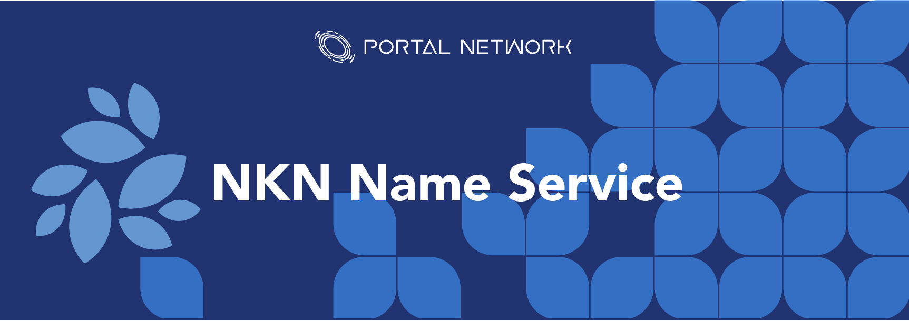

> 📖🔍 Documents of the NKN Name Service.

# Overview

## 💡 What is NKN?
NKN is the next generation of peer to peer network infrastructure built upon blockchain technology backed by Cellular Automata theory aiming at revolutionizing the Internet with true decentralization and native token incentive mechanism. NKN introduced the concept of Decentralized Data Transmission Network (DDTN). DDTN combines multiple independent and self-organized relay nodes to provide clients with connectivity and data transmission capability.
NKN introduces `Proof of Relay` as consensus mechanism and incentive model which encourages people to join the network to share and enhance network connectivity and data transmission. In short, the reward is depending on the data amount of a node relays. It makes whole network retain high efficiency as well. The "mining" is redefined as contributing to the data transmission layer, and the only way to get more rewards is providing more transmission power.

## 💡 What is BNS?
BNS – or blockchain name system – is the protocol on the internet that turns human-comprehensible decentralized website names such as ‘website.xem’ or ‘mywebsite.xem’ into addresses understandable by decentralized network machines.

## 📝 Description

NNS is the NKN Name Service, a distributed, open, and extensible naming system based on the NKN blockchain.

## 📚 Documents

#### Table of Contents
- [Introduction](./docs/INTRODUCTION.md)
- [Implementation](./docs/IMPLEMENTATION.md)
    - [Registry](./docs/REGISTRY.md)
    - [Registrar](./docs/REGISTRAR.md)
    - [Resolver](./docs/RESOLVER.md)
- [Integration](./docs/INTEGRATION.md)

## 🗂️ NKN Technical Stack
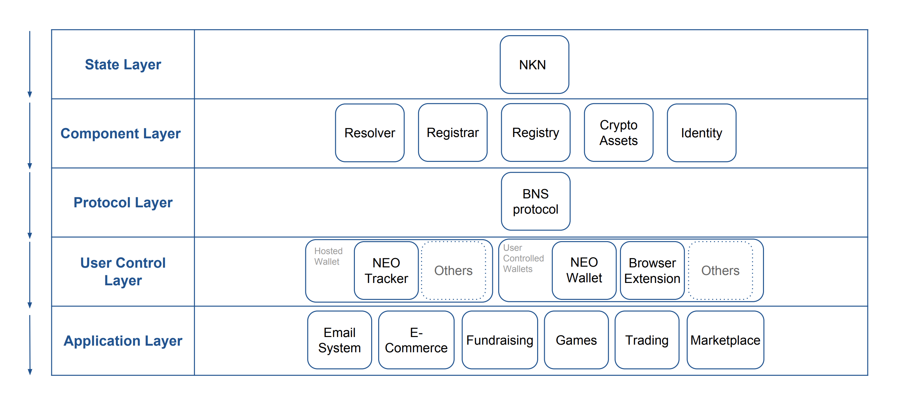
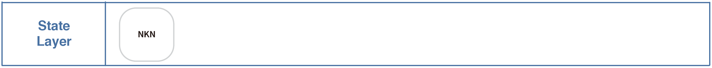
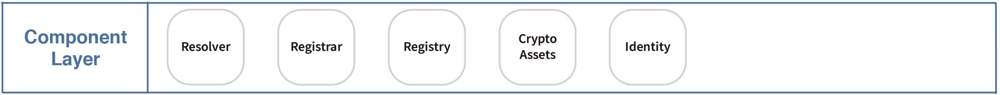
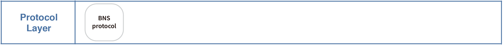
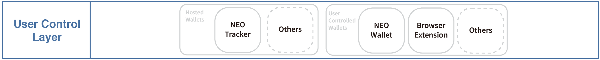
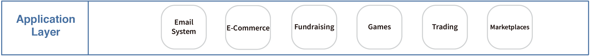

# Introduction

## Proof of Relay and consensus
PoR is a useful proof of work, it redefines mining as relaying data. PoR's implementation is basded on a special `signature chain`. In simple terms, the PoR signature chain is a hash chain that relay nodes sign in turn when relaying data packets. 

A signature chain is a chain of signature, signed by data relayers sequentially when relaying NKN packet. Each element of the chain consists of the following fields:

1. Relayer NKN address and public key.
2. Next relayer NKN address.
3. Signature(signature of the previous element on chain, relayer NKN address, next relayer NKN address) signed with relayer private key.

The first element of the signature chain is signed by source, and the signature field is replaced by signature(payload hash, payload size, source NKN address and public key, destination NKN address and public key, next relayer NKN address).
Signature chain cannot be forged because each element contains the NKN address and public key of the next node.  If a malicious node is on the route and intends to modify some previous elements on the chain when generating his signature, the chain is no longer valid.

New block is added to the blockchain by first selecting a `“leader”` that proposes the new block. The leader selection is uncontrollable but verifiable. The expected probability that a node is elected as leader is proportional to the data relayed by the node on secure paths.

## Leader selection procedure
`Leader` is selected by first selecting a signature chain on a secure path. The signature chain being selected is the one that has the lowest last signature value. To select the signature chain with lowest last signature, each node who signs the last signature checks if the last signature is smaller than a threshold. If the last signature is smaller than the threshold, the node sends out the signature chain to the network as a candidate for the lowest last signature.

## Block creation
Block is proposed by the selected leader in each round. Proposed block is sent to all nodes for verification and consensus. During consensus phase, each node sends to its neighbors the hash of the block (in case the leader sends out different blocks to different neighbors) and if it is accepted or not. 

In the PoR algorithm, the bookkeeper candidate vote is not a vote of a person or IP address, but a vote of a signature chain. If any malicious node wants to control NKN, it must have enough active channels (signature chain) under control. The larger scale of NKN the more difficult it is to control. 

## Start NKN using docker

### Prerequisites

- Clone NKN project.
```
git clone https://github.com/nknorg/nkn.git
```
- `Docker` installed.

### Build using docker

1. Change current directory to `nkn` project.
```
cd nkn
```

2. Build dokcer image.
```
docker build -t nkn .
```

3. After docker image built successfully, we need to prepare a configuration file for starting a node. There are two default configuration files in `nkn` project:
- `config.testnet.json`: used to join the testnet.
- `config.local.json`: create and join a private chain on your localhost.
In this tutorial, we want to make our own node become part of the testnet, so we will choose `config.testnet.json` as configuration file.
    ```
    cp config.testnet.json config.json
    ```
    And open the `config.json` file:
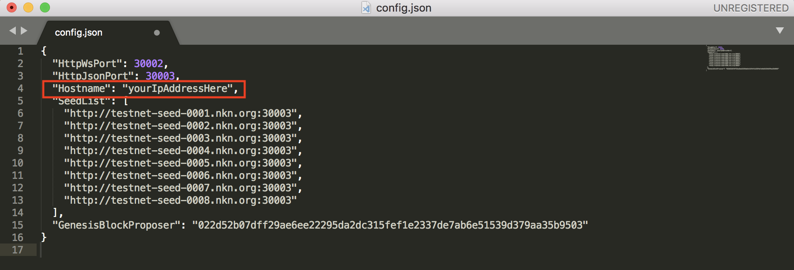
    - Replace `Hostname` with your IP address.
    ### Note:
    NKN needs a public static IP or set up [port forwarding](https://portforward.com/) on your router properly to join the testnet.

4. Before starting the node, we need to create a new wallet first:
```
docker run -it -v $PWD:/nkn nkn nknc wallet -c
```
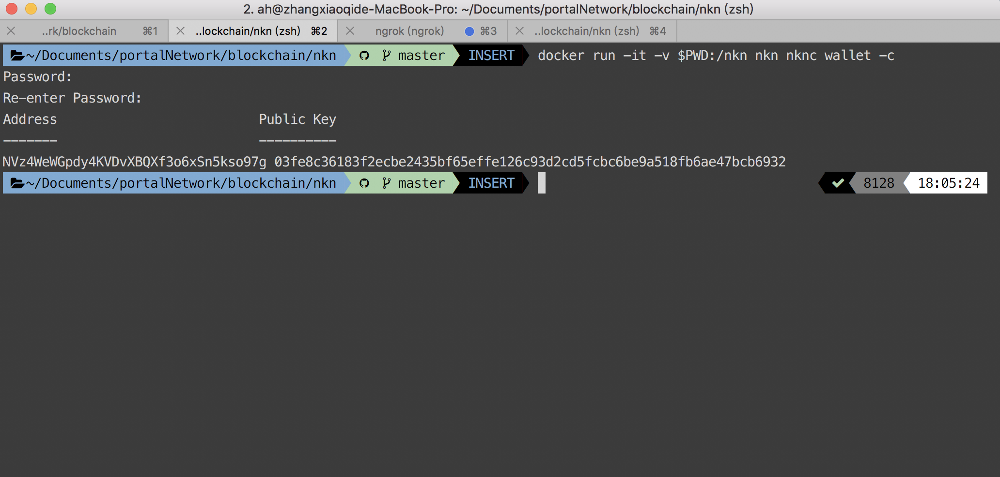

5. After wallet created, we can start to deploy local node:
```
docker run -p 30000-30003:30000-30003 -v $PWD:/nkn --name nkn --rm -it nkn nknd
```
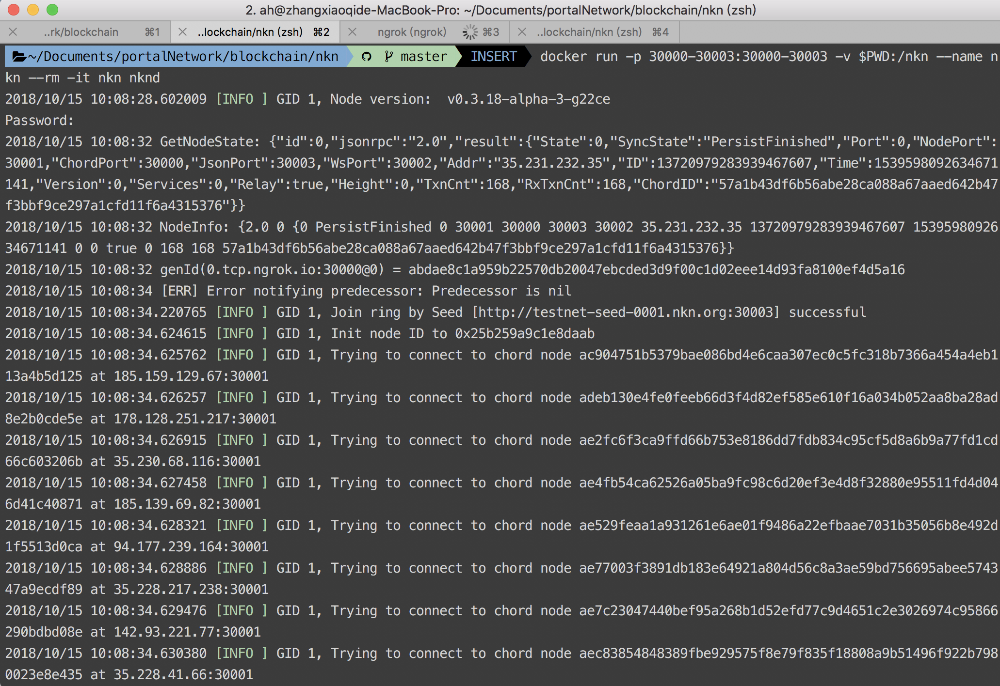

## Start NKN manual

### Prerequisites

- [Go 1.10+](https://golang.org/doc/install) installed.

- `$GOROOT` and `$GOPATH` environment variable configured.
    ```
    export GOROOT=$(go env GOROOT)
    export GOPATH=$(go env GOPATH)
    export GOBIN=$GOPATH/bin
    export PATH=$PATH:$GOBIN
    ```

- Create directory $GOPATH/src/github.com/nknorg/ if not exists.
    ```
    mkdir -p $GOPATH/src/github.com/nknorg
    ```

### Building from source

1. Clone [nkn](https://github.com/nknorg/nkn) project to `$GOPATH/src/github.com/nknorg/`.
```
cd $GOPATH/src/github.com/nknorg/
git clone https://github.com/nknorg/nkn.git
```

2. Install package management tool `glide`.
```
cd nkn
make glide
```

3. Download dependency module and build project.
```
make vendor
make
```

4. After source code built successfully, we need to prepare a configuration file for starting a node. There are two default configuration files in `nkn` project:
- `config.testnet.json`: used to join the testnet.
- `config.local.json`: create and join a private chain on your localhost.
In this tutorial, we want to make our own node become part of the testnet, so we will choose `config.testnet.json` as configuration file.
    ```
    cp config.testnet.json config.json
    ```
    And open the `config.json` file:

    - Replace `Hostname` with your IP address.
    ### Note:
    NKN needs a public static IP or set up [port forwarding](https://portforward.com/) on your router properly to join the testnet.

5. Before starting the node, we need to create a new wallet first:
```
./nknc wallet -c
```
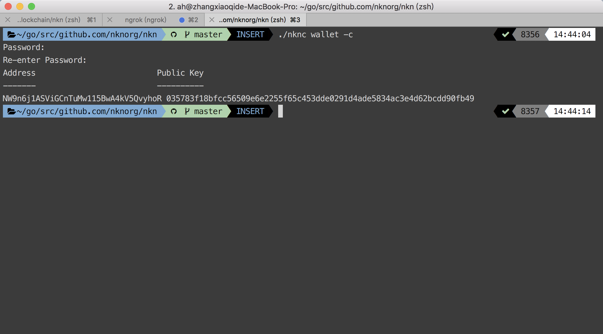

6. After wallet created, we can start to deploy local node:
```
./nknd
```
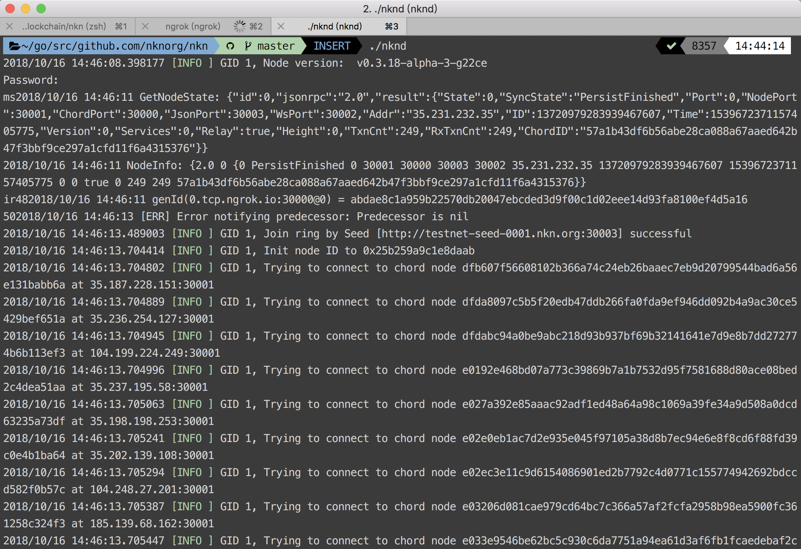

## 🔗 Resources
- [Deep dive of NKN](https://medium.com/nknetwork/deep-dive-into-nkn-system-architecture-41c0ac4c925e)
- [Proof of Relay](https://github.com/nknorg/nkn/wiki/Tech-Design-Doc%3A-Proof-of-Relay-%28PoR%29)
- [NKN consensus](https://github.com/nknorg/nkn/wiki/Tech-Design-Doc%3A-Consensus-and-Blockchain)
- [nkn-client-js](https://github.com/nknorg/nkn-client-js)
- [nkn-client-protocol](https://github.com/nknorg/nkn/wiki/NKN-Client-Protocol)
- [NKN docker](https://github.com/nknorg/nkn#building-using-docker)

## 📣 Contributing
See [CONTRIBUTING.md](./CONTRIBUTING.md) for how to help out.

## 🗒 Licence
See [LICENSE](./LICENSE) for details.
