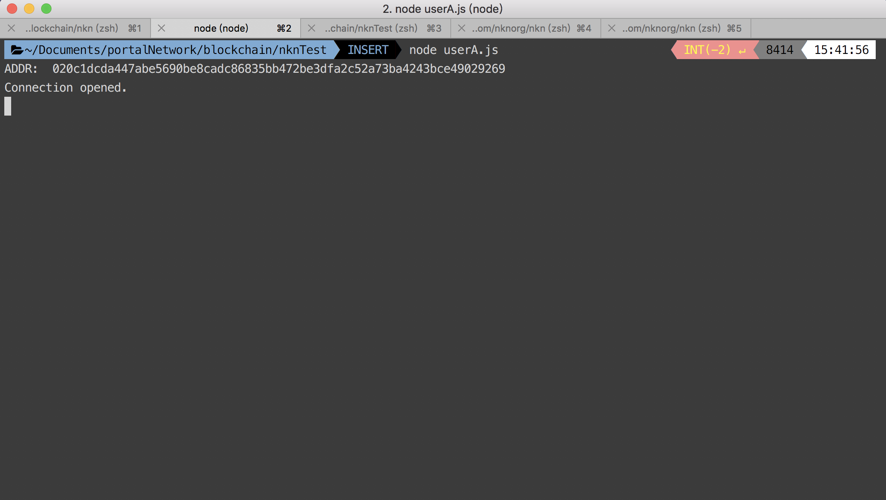
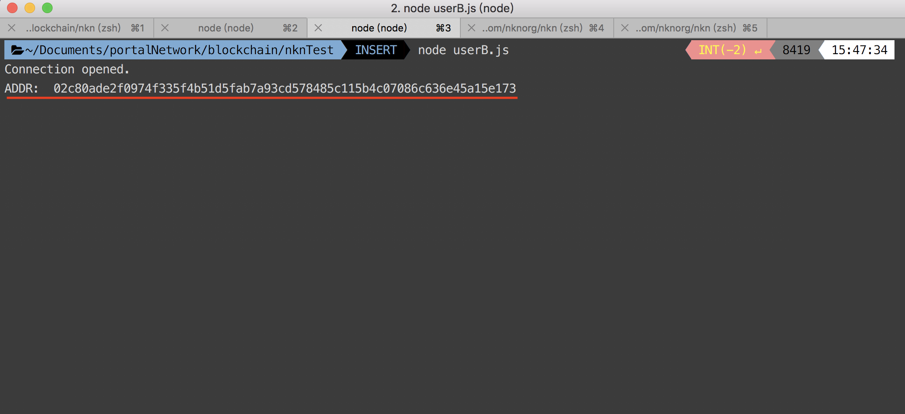
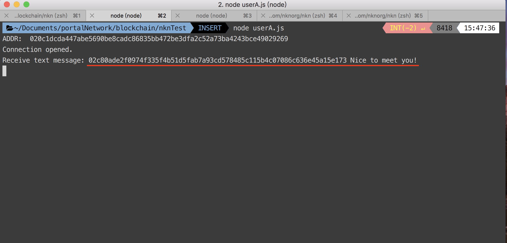
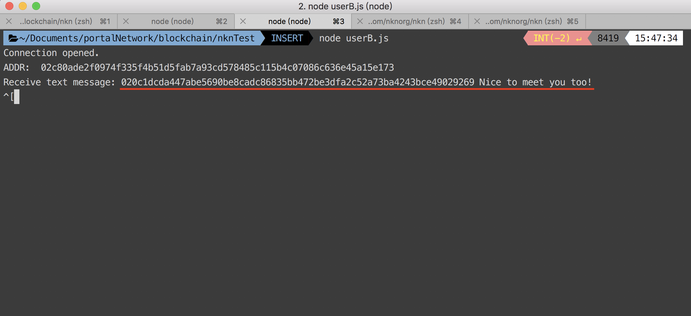

# What is NKN?

NKN is the next generation of peer to peer network infrastructure built upon blockchain technology backed by Cellular Automata theory aiming at revolutionizing the Internet with true decentralization and native token incentive mechanism. NKN introduced the concept of Decentralized Data Transmission Network (DDTN). DDTN combines multiple independent and self-organized relay nodes to provide clients with connectivity and data transmission capability.
NKN introduces `Proof of Relay` as consensus mechanism and incentive model which encourages people to join the network to share and enhance network connectivity and data transmission. In short, the reward is depending on the data amount of a node relays. It makes whole network retain high efficiency as well. The "mining" is redefined as contributing to the data transmission layer, and the only way to get more rewards is providing more transmission power.

## Connect to NKN based on NKN client

Here is a example of using NKN infrastructure which allows you send packets within NKN. We'll use NKN offically provided library([nkn-client-js](https://github.com/nknorg/nkn-client-js)) in the following example. It allows you to send and receive data between any NKN clients without setting up a server.

First of all, install the package `nkn-client-js`:
```
npm install nkn-client
```

Next, create a js file and paste the following code snippets:
```js
//userA.js
const nkn = require('nkn-client');

const clientTest = () => {
	const client = nkn();
    console.log("ADDR: ", client.addr);
	client.on('connect', () => {
		console.log('Connection opened.');
	});
	client.on('message', (src, payload, payloadType) => {
		if (payloadType === nkn.PayloadType.TEXT) {
			console.log('Receive text message:', src, payload);
		} else if (payloadType === nkn.PayloadType.BINARY) {
			console.log('Receive binary message:', src, payload);
		}
		client.send(
			src,
			'Nice to meet you too!'
		);
	});
	
};
clientTest();
```

Execute the program with `node`:
```
node userA.js
```

Copy the address.

create another file and paste the following code snippets:
```js
//userB.js
const nkn = require('nkn-client');
// Replace destAddr with just copied address here
const destAddr = '03cbfbc19c1272a82408b0982ec6fa9bd91096f2508ea0108d55dae5021b3d25a6';
const clientTest = () => {
	const client = nkn();
	client.on('connect', () => {
		console.log('Connection opened.');
		console.log("ADDR: ", client.addr);
		client.send(
			destAddr,
			'Nice to meet you!'
		);
	});
	client.on('message', (src, payload, payloadType) => {
		if (payloadType === nkn.PayloadType.TEXT) {
			console.log('Receive text message:', src, payload);
		} else if (payloadType === nkn.PayloadType.BINARY) {
			console.log('Receive binary message:', src, payload);
		}
	});
};
clientTest();
```
Note: Remember to replace destAddr with just copied address.

Execute the program with `node` as well:


Check out the `userA` console and it should output the userB's message:


Back to `userB` console, you should see userA's response:


The above is a simple example of interchange messages between two different clients among NKN.
Each NKN client has a designated NKN node it should establish websocket connection depending on the client NKN address. Trying to connect to other nodes will get an error. During initialization, client should make a JSON-RPC call to rpc server to get the node it should establish websocket connection with.

## Reference
- [nkn-client-js](https://github.com/nknorg/nkn-client-js)
- [NKN-Client-Protocol](https://github.com/nknorg/nkn/wiki/NKN-Client-Protocol)
